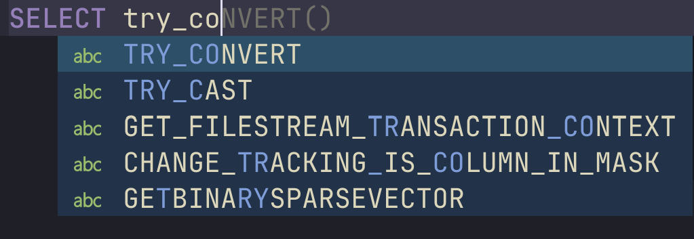
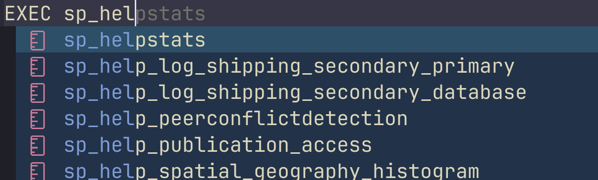
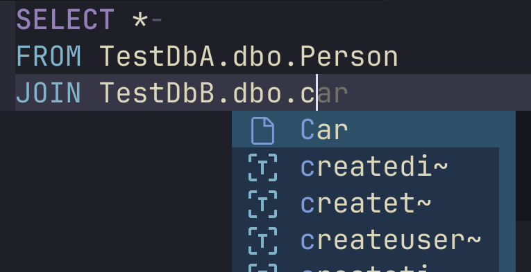

# mssql.nvim

<p align="center" >

</p>

<p align="center" >
An SQL Server plugin for neovim. Like it? Give a ⭐️!
</p>

## Features

Completions, including TSQL keywords,



stored procedures



and cross database queries



Execute queries, with results in markdown tables for autoamtic colouring and
rendering


Optional which-key integration, showing only the key bindings which are possible
(eg don't show `Connect` if we are already connected)


## Requirements

- Neovim v0.11.0 or later

## Setup

```lua
-- Basic setup
require("mssql.nvim").setup()
require("mssql.nvim").set_keymaps("<leader>d")

-- With options (see below)
require("mssql.nvim").setup({
  max_rows = 50,
  max_column_width = 50,
})

-- With callback
require("mssql.nvim").setup({
  max_rows = 50,
  max_column_width = 50,
}, function()
  print("mssql.nvim is ready!")
end)
```

### Options

| Name               | Type      | Description                                                                                                                                                       | Default                       |
| ------------------ | --------- | ----------------------------------------------------------------------------------------------------------------------------------------------------------------- | ----------------------------- |
| `max_rows`         | `int?`    | Max rows to return for queries. Needed so that large results don't crash neovim.                                                                                  | `100`                         |
| `max_column_width` | `int?`    | If a result row has a field text length larger than this it will be truncated when displayed                                                                      | `100`                         |
| `data_dir`         | `string?` | Directory to store download tools and internal config options                                                                                                     | `vim.fn.stdpath("data")`      |
| `tools_file`       | `string?` | Path to an existing [SQL tools service](https://github.com/microsoft/sqltoolsservice/releases) binary. If `nil`, then the binary is auto downloaded to `data_dir` | `nil`                         |
| `connections_file` | `string?` | Path to a json file containing connections (see below)                                                                                                            | `<data_dir>/connections.json` |

### Notes

- `setup()` runs asynchronously as it may take some time to first download and
  extract the sql tools. Pass a callback as the second argument if you need to
  run code after initialization.

## Usage

```lua
local mssql = require("mssql")

-- Open sql connections file for editing. See below for more
mssql.edit_connections()

-- Open a new buffer for sql queries
mssql.new_query()

-- Look for the connection called "default", prompt to choose a database in that server,
-- connect to that database and open a new buffer for querying (very useful!)
mssql.new_default_query()

-- Connect the current buffer (you'll be prompted to choose a connection)
mssql.connect()

-- Rebuild the intellisense cache
mssql.refresh_intellisense_cache()

-- Disconnects the current buffer
mssql.disconnect()
```

## Connections json file

The format is `"connection name": connection object`. Eg:

```json
{
  "Connection A": {
    "server": "localhost",
    "database": "dbA",
    "authenticationType": "SqlLogin",
    "user": "Admin",
    "password": "Your_Password",
    "trustServerCertificate": true
  },
  "Connection B": {
    "server": "AnotherServer",
    "database": "dbB",
    "authenticationType": "Integrated"
  },
  "Connection C": {
    "connectionString": "Server=myServerAddress;Database=myDataBase;User Id=myUsername;Password=myPassword;"
  }
}
```

[Full details of the connection json here](docs/Connections-Json.md).
